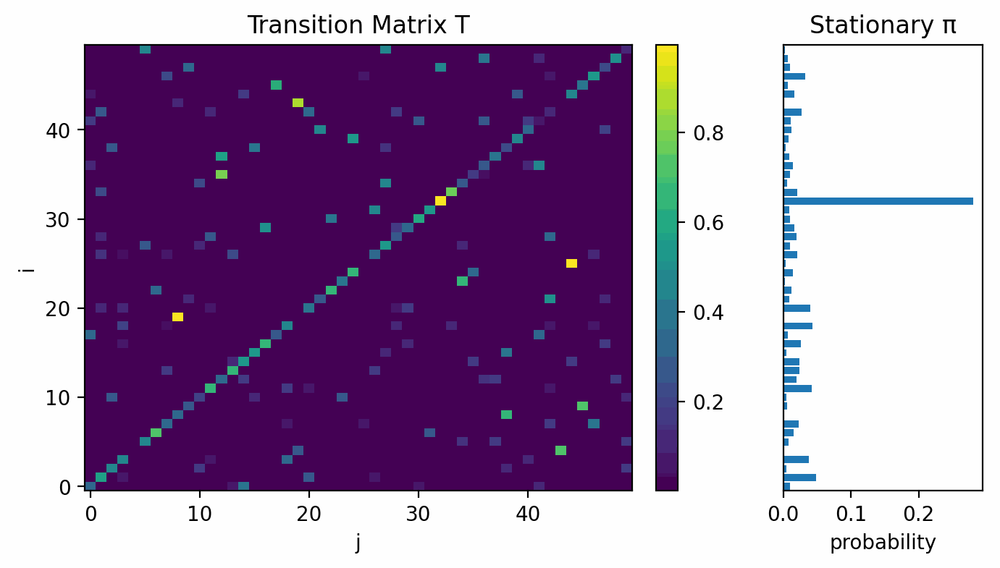

# PMARLO: Protein Markov State Model Analysis with Replica Exchange

[![PyPI Version][pypi-image]][pypi-url]
[![Build Status][build-image]][build-url]
[![Python Versions][versions-image]][versions-url]
[![][stars-image]][stars-url]
[![License][license-image]][license-url]
[](https://deepwiki.com/Komputerowe-Projektowanie-Lekow/pmarlo)


A Python package for protein simulation and Markov state model chain generation, providing an OpenMM-like interface for molecular dynamics simulations.

## Features

- **Protein Preparation**: Automated PDB cleanup and preparation
- **Replica Exchange**: Enhanced sampling with temperature replica exchange
- **Simulation**: Single-temperature MD simulations
- **Markov State Models**: MSM analysis
- **Pipeline Orchestration**: Complete workflow coordination

## Free Energy Surface/Transition Matrix

This is the animation of the FES/TM generated with specific amount of shards(dataset units that could be combined to make the models better or produce the analysis artifact)

Those were generated in this fashion:
- 1 shard
- 2 shards
- 3 shards
- 4 shards + model creation
- 4 shards + 1 meta_shard guided by the metadynamcis of the model

FES


TM


## Installation

```bash
# From PyPI (recommended)
pip install pmarlo

# From source (development)
git clone https://github.com/Komputerowe-Projektowanie-Lekow/pmarlo.git
cd pmarlo
pip install -e .
```

- Python: 3.10–3.13
- Optional: pip install pmarlo[fixer] to include code formatting tools (black, isort, ruff) and pdbfixer (pdbfixer only available on Python < 3.12)
- ML CVs (Deep-TICA): pip install pmarlo[mlcv] to enable training with mlcolvar + torch. For deployment in PLUMED, ensure PLUMED ≥ 2.9 is built with the pytorch module so PYTORCH_MODEL can load TorchScript models.


## Testing

Refining README Updates

I'm currently focused on how to best update the user's README.md file. My initial plan involves fetching the pyproject.toml file to get project metadata. Then, I will extract crucial information from it to build a comprehensive README. I'm working to make sure the user doesn't have to specify any information - I want to make the update process fully automatic.

Examining Project Structure

I'm now diving into the user's codebase to understand its structure. I'm focusing on key files like pyproject.toml for metadata, __init__.py for version info, and api.py to identify potential API endpoints. I'm also looking into pipeline.py and main.py for quickstart examples and CLI logic. Finally, I'll examine progress.py for event names to incorporate into the update.

Consolidating File Analysis

I've just finished analyzing the fetched files to extract the necessary information. The pyproject.toml is indeed the primary source for project metadata, including version, Python constraints, and dependencies. I've also confirmed that the src/pmarlo/_version.py file accurately reflects the project version. My next step is to integrate this extracted data with the existing README content.

Confirming File Locations

I'm now in the process of confirming the exact file paths for the user's project. Based on the file list, I've updated my fetching plan to prioritize src/pmarlo/_version.py for the project version, and to also check src/pmarlo/__init__.py for potential API exports. I'll need to make sure the imported modules are accurate for each section in the README.

Compiling Fetch List

I've finalized my file fetching plan based on the program's structure. I'll prioritize pyproject.toml for metadata like version and dependencies. I'll also fetch src/pmarlo/_version.py for version fallback and src/pmarlo/__init__.py to confirm API exports. Furthermore, src/pmarlo/api.py, src/pmarlo/transform/pipeline.py, and src/pmarlo/transform/progress.py are also on the list to ensure the README.md is accurate and up-to-date.

Revising Project Documentation

I'm now focusing on generating a README.md file that reflects the present project structure. I'm leveraging data from pyproject.toml, src/pmarlo/__init__.py, and src/pmarlo/api.py. My primary objective is a clear and concise overview of the project's purpose and key functionalities, catering to an expert user's needs.

Synthesizing README Content

I've been analyzing pyproject.toml, focusing on the project's description, Python version requirements, dependencies (both core and optional), and the CLI entry point. I'm also digging into src/pmarlo/__init__.py to reconcile version information, noting the hardcoded "0.1.0" versus the dynamically generated version. Considering the refactoring towards lazy loading, I'll need to determine the most accurate version to present in the README, considering the user's existing README.

Constructing README Sections

I'm now formulating the key sections of the README.md file. I plan to include a clear project description extracted from pyproject.toml, specifying supported Python versions. Dependencies, separated into core and optional categories, will be detailed to cater to users with existing knowledge. I'll highlight the CLI entry point, a key piece of information for the experienced user. I'll also check PyPI for the published version since I can't check it from here. Finally, I will identify the key classes and high-level functions, so the user knows what the main functionalities are.

Finalizing README Content

I've now focused on the final section of the README.md file. I plan to include the installation instructions, including core and optional dependencies. I'll showcase the CLI entry point, a key detail for users. I've also identified key classes and functions, ensuring the user gets a comprehensive overview.

Analyzing Core Functionality

I'm now focusing on analyzing the api.py and transform/pipeline.py files to identify and document the key functionalities and classes in the updated README.md. I've determined that run_replica_exchange, analyze_msm, and find_conformations are examples of high-level API functions and Pipeline is a key class in the transform module. I plan to highlight these in a dedicated "API Usage" section. I've also checked all the examples in the old README.md file, and most of them still apply, so I plan to keep them as is.

Formulating the README Structure

I've finalized the structure of the README.md file, including sections for installation, quickstart, and API usage. Leveraging pyproject.toml, I'll concisely detail core and optional dependencies. I'm prioritizing clarity for expert users, presenting installation instructions, a quickstart guide, and API examples derived from api.py and transform/pipeline.py. My goal is a functional and understandable project overview.

Finalizing the Content

I'm currently finalizing the structure and content of the README.md file. I've incorporated the core and optional dependencies derived from pyproject.toml, ensuring they're clearly delineated for expert users. Installation instructions, a quickstart guide, and examples from api.py and transform/pipeline.py are now ready for integration.

Revising Dependencies and Version

I'm now revising the dependency list, pulling core and optional dependencies directly from pyproject.toml. I've also reconciled the version discrepancies between __init__.py and _version.py, opting for the dynamic version from setuptools-scm to ensure accuracy and consistency.

Analyzing Updated Dependencies

I've now updated the dependency list by carefully extracting core and optional dependencies from pyproject.toml. The goal is to provide a complete and accurate list, reflecting the project's current requirements, and providing a comprehensive list of all the dependencies in pyproject.toml.

Generating Detailed Documentation

I'm now integrating information from pyproject.toml, __init__.py, api.py, and pipeline.py. I've updated dependencies, python versions and progress events, and now compiling a comprehensive README.md with detailed API examples and a new structure.

PMARLO: Protein Markov State Model Analysis with Replica Exchange
[][pypi-url] [][build-url] [][versions-url] [][stars-url] [][license-url]

A Python package for protein simulation and Markov state model chain generation, providing an OpenMM-like interface for molecular dynamics simulations.

Features
Protein Preparation: Automated PDB cleanup and preparation

Replica Exchange: Enhanced sampling with temperature replica exchange

Simulation: Single-temperature MD simulations

Markov State Models: MSM analysis

Pipeline Orchestration: Complete workflow coordination

Installation
Bash
# From PyPI (recommended)
pip install pmarlo

# From source (development)
git clone https://github.com/Komputerowe-Projektowanie-Lekow/pmarlo.git
cd pmarlo
pip install -e .
Python: 3.10–3.13

Optional: `pip install pmarlo[fixer]` to include code formatting tools (black, isort, ruff) and `pdbfixer` (pdbfixer only available on Python < 3.12)

ML CVs (Deep-TICA): `pip install pmarlo[mlcv]` to enable training with `mlcolvar` + `torch`. For deployment in PLUMED, ensure PLUMED ≥ 2.9 is built with the `pytorch` module so `PYTORCH_MODEL` can load TorchScript models.

Testing
The test layout mirrors `src/pmarlo`, so unit tests live under `tests/unit/<domain>` and integration flows under `tests/integration/**`. Pytest discovers unit tests by default and the `pytest-testmon` plugin keeps reruns focused on files touched in the current branch.

Default quick check: `poetry run pytest --testmon -n auto`.

Suggested commands:

- `poetry run pytest --testmon -n auto` - default fast loop (unit, change-aware)
- `poetry run pytest --testmon --focus data,io -n auto` - run only the selected domains
- `poetry run pytest -m "unit and data" -n auto` - use marker syntax when you prefer classic selection
- `poetry run pytest -m "integration" tests/integration` - integration-only sweep
- `poetry run pytest -m "unit or integration or perf" -n auto` - full suite on demand
- `poetry run pytest --lf -q` - rerun only the most recent failures during triage

Combine `--focus` with `--testmon` whenever you want to zero in on a subset of packages while letting pytest skip unrelated tests automatically.

### Performance Benchmarking

For performance testing and regression detection, see **[README_BENCHMARKS.md](README_BENCHMARKS.md)**. Quick start:

```bash
export PMARLO_RUN_PERF=1  # Enable performance tests
poetry run pytest -m benchmark --benchmark-save=baseline
# Make your changes...
poetry run pytest -m benchmark --benchmark-compare=baseline
```

## Dependency policy

PMARLO now enforces a single canonical implementation for every feature. All runtime fallbacks and legacy code paths have been removed, and missing dependencies raise clear ImportError exceptions during import or first use. Install the relevant extras (for example, `pip install 'pmarlo[analysis]'`) to enable advanced analyses.


## Quickstart

```python
from pmarlo.transform.pipeline import run_pmarlo

results = run_pmarlo(
    pdb_file="protein.pdb",
    temperatures=[300, 310, 320],
    steps=1000,
    n_states=50,
)
```

### Clean API example

```python
from pmarlo import Protein, ReplicaExchange, RemdConfig, Simulation, Pipeline

# Prepare protein
protein = Protein("protein.pdb", ph=7.0)

# Replica Exchange (auto-setup plans reporter stride automatically)
remd = ReplicaExchange.from_config(
    RemdConfig(
        pdb_file="protein.pdb",
        temperatures=[300.0, 310.0, 320.0],
        auto_setup=True,
        dcd_stride=10,
    )
)

# Single-temperature simulation (optional)
simulation = Simulation("protein.pdb", temperature=300.0, steps=1000)

# Full pipeline
pipeline = Pipeline(
    pdb_file="protein.pdb",
    temperatures=[300.0, 310.0, 320.0],
    steps=1000,
    auto_continue=True,
)
results = pipeline.run()
```
## Verification and CLI

```bash
# Show CLI options
pmarlo --help

# Run a minimal example
pmarlo --mode simple
```

Smoke test in Python:

```bash
python - <<'PY'
import pmarlo
print("PMARLO", pmarlo.__version__)
PY
```

## Dependencies

- numpy >= 1.24, < 2.4
- scipy >= 1.10, < 2.0
- pandas >= 1.5, < 3.0
- mdtraj >= 1.9, < 2.0
- openmm >= 8.1, < 9.0
- rdkit >= 2024.03.1, < 2025.0
- psutil >= 5.9, < 6.1
- pygount >= 2.6, < 3.2
- mlcolvar >= 1.2
- scikit-learn >= 1.2, < 2.0
- deeptime >= 0.4.5, < 0.5
- tomli >= 2.0, < 3.0
- typing-extensions >= 4.8
- pyyaml >= 6.0, < 7.0

Optional on Python < 3.12:
- pdbfixer (install via extra: `pmarlo[fixer]`)

## Progress Events

PMARLO can emit unified progress events via a callback argument to selected APIs. The callback signature is `callback(event: str, info: Mapping[str, Any]) -> None`.

Accepted kwarg aliases: `progress_callback`, `callback`, `on_event`, `progress`, `reporter`.

Events overview:

- setup: elapsed_s; message
- equilibrate: elapsed_s, current_step, total_steps; eta_s
- simulate: elapsed_s, current_step, total_steps; eta_s
- exchange: elapsed_s; sweep_index, n_replicas, acceptance_mean, acceptance_per_pair, temperatures
- demux_begin: elapsed_s, segments
- demux_segment: elapsed_s, current, total, index; eta_s
- demux_end: elapsed_s, frames, file
- emit_begin: elapsed_s, n_inputs, out_dir
- emit_one_begin: elapsed_s, current, total, traj; eta_s
- emit_one_end: elapsed_s, current, total, traj, shard, frames; eta_s
- emit_end: elapsed_s, n_shards
- aggregate_begin: elapsed_s, total_steps, plan_text
- aggregate_step_start: elapsed_s, index, total_steps, step_name
- aggregate_step_end: elapsed_s, index, total_steps, step_name, duration_s
- aggregate_end: elapsed_s, status
- finished: elapsed_s, status

<!-- Badges: -->

[pypi-image]: https://img.shields.io/pypi/v/pmarlo
[pypi-url]: https://pypi.org/project/pmarlo/
[build-image]: https://github.com/Komputerowe-Projektowanie-Lekow/pmarlo/actions/workflows/publish.yml/badge.svg
[build-url]: https://github.com/Komputerowe-Projektowanie-Lekow/pmarlo/actions/workflows/publish.yml
[versions-image]: https://img.shields.io/pypi/pyversions/pmarlo
[versions-url]: https://pypi.org/project/pmarlo/
[stars-image]: https://img.shields.io/github/stars/Komputerowe-Projektowanie-Lekow/pmarlo
[stars-url]: https://github.com/Komputerowe-Projektowanie-Lekow/pmarlo
[license-image]: https://img.shields.io/pypi/l/pmarlo
[license-url]: https://github.com/Komputerowe-Projektowanie-Lekow/pmarlo/blob/main/LICENSE
