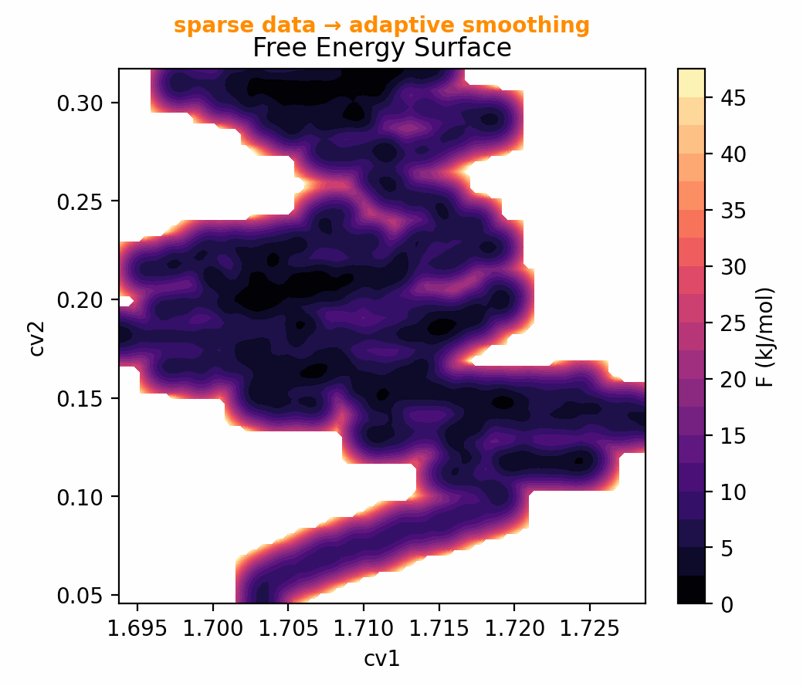
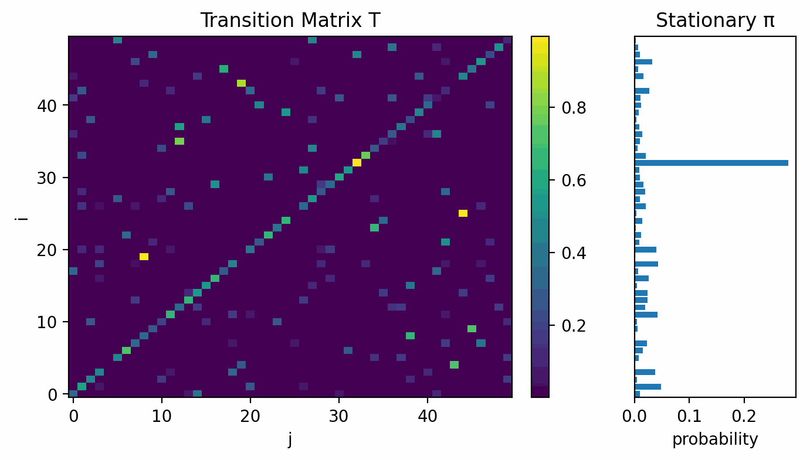

# PMARLO: Protein Markov State Model Analysis with Replica Exchange

[![PyPI Version][pypi-image]][pypi-url]
[![Build Status][build-image]][build-url]
[![Python Versions][versions-image]][versions-url]
[![][stars-image]][stars-url]
[![License][license-image]][license-url]
[](https://deepwiki.com/Komputerowe-Projektowanie-Lekow/pmarlo)


A Python package for Conformation finding, protein simulation and Markov state model chain generation, providing an OpenMM-like interface for molecular dynamics simulations.

## Features

- **Protein Preparation**: Automated PDB cleanup and preparation
- **Replica Exchange**: Enhanced sampling with temperature replica exchange
- **Simulation**: Single-temperature MD simulations
- **Different shards**: Cosutomizable shard modes for specific purposes.
- **Markov State Models**: MSM analysis
- **DeepTICA model training**: Creates model to metabias the simulations with specific force on the CVs.
- **ITS analysis**: Helps to find the slow modes of the protein to get the most of the data from the smalles computation time.
- **Conformations finding**: Enables to get the conformations from currently discovered potential FES. 
- **Pipeline Orchestration**: Complete workflow coordination


## Free Energy Surface/Transition Matrix

This is the animation of the FES/TM generated with specific amount of shards(dataset units that could be combined to make the models better or produce the analysis artifact)

Those were generated in this fashion:
- 1 shard
- 2 shards
- 3 shards
- 4 shards + model creation
- 4 shards + 1 meta_shard guided by the metadynamcis of the model

FES(PMARLO Webapp) 


TM(PMARLO Webapp) 


Idea of sampling the protein(PMARLO Webapp) 


FES with different shard(PMARLO Webapp) 


Stationary distirbution of the protein(PMARLO Webapp)


PCCA with conformations on top of FES(PMARLO Webapp)


Frames per shard(PMARLO Webapp)


Free Energy Validation(PMARLO Webapp)


DeepTICA model preview(PMARLO Webapp)


OpenMM-Torch Bias Benchmark(Example programs)


ITS(PMARLO Webapp)


## Installation

```bash
# From PyPI (recommended)
pip install pmarlo

# From source (development)
git clone https://github.com/Komputerowe-Projektowanie-Lekow/pmarlo.git
cd pmarlo
pip install -e .
```

- Python: 3.10–3.13
- Optional: pip install pmarlo[fixer] to include code formatting tools (black, isort, ruff) and pdbfixer (pdbfixer only available on Python < 3.12)
- ML CVs (Deep-TICA): pip install pmarlo[mlcv] to enable training with mlcolvar + torch. For deployment in PLUMED, ensure PLUMED ≥ 2.9 is built with the pytorch module so PYTORCH_MODEL can load TorchScript models.


## Testing

Testing
The test layout mirrors `src/pmarlo`, so unit tests live under `tests/unit/<domain>` and integration flows under `tests/integration/**`. Pytest discovers unit tests by default and the `pytest-testmon` plugin keeps reruns focused on files touched in the current branch. There is a great experiment suite implemented in the package itself and the example programs to for example benchmark openmm-torch script simulation bias.

Default quick check: `poetry run pytest --testmon -n auto`.

Suggested commands:

- `poetry run pytest --testmon -n auto` - default fast loop (unit, change-aware)
- `poetry run pytest --testmon --focus data,io -n auto` - run only the selected domains
- `poetry run pytest -m "unit and data" -n auto` - use marker syntax when you prefer classic selection
- `poetry run pytest -m "integration" tests/integration` - integration-only sweep
- `poetry run pytest -m "unit or integration or perf" -n auto` - full suite on demand
- `poetry run pytest --lf -q` - rerun only the most recent failures during triage

Combine `--focus` with `--testmon` whenever you want to zero in on a subset of packages while letting pytest skip unrelated tests automatically.

### Performance Benchmarking

Quick start:

```bash
export PMARLO_RUN_PERF=1  # Enable performance tests
poetry run pytest -m benchmark --benchmark-save=baseline
# Make your changes...
poetry run pytest -m benchmark --benchmark-compare=baseline
```

## Dependency policy

PMARLO now enforces a single canonical implementation for every feature. All runtime fallbacks and legacy code paths have been removed, and missing dependencies raise clear ImportError exceptions during import or first use. Install the relevant extras (for example, `pip install 'pmarlo[analysis]'`) to enable advanced analyses.

The most suitable usage is to create the micromamba environment with openmm-torch script and the PDBFixer. Rest of the dependencies are suitable for the pip and could be downloaded there. At the moment the current usage is with micromamba environment with , poetry pip .e intalled

I would encourage to download is as a repo, install the dependencies and create your own data in the pmarlo_webapp. After you got an example of 5 run(5 times - simulation of 50K steps of a protein - step by step, not from the same PDB each time.) You could do the model training and the analysis.
For the conformations I tested it with 35 shards and approximately 13K frames.


My examples:
1. Pmarlo_webapp
```commandline
micromamba activate ommtorch
streamlit run .\pmarlo_webapp\app\app.py 
```
2. Bias benchmark(the model and protein should be provided by user)
```commandline
micromamba activate ommtorch
cd .\example_programs\
python .\bench_openmm.py --with-bias=yes --model=C:\Users\konrad_guest\Documents\GitHub\pmarlo\pmarlo_webapp\app_output\models\deeptica-20251108-195911.pt --steps 5000 --platform CPU --pdb C:\Users\konrad_guest\Documents\GitHub\pmarlo\pmarlo_webapp\app_input\3gd8-fixed.pdb
```

## Quickstart

The repository ships with runnable programs under `example_programs` that use the
same APIs you would call in your own projects. After installation (see
**Installation** above), run the following from the project root:

1. **Verify your environment and assets**
   ```bash
   poetry run python -m example_programs.verify_pmarlo
   ```
   This script loads the bundled `tests/_assets/3gd8-fixed.pdb`, instantiates the
   core objects (`Protein`, `ReplicaExchange`, `Simulation`, `MarkovStateModel`)
   and runs a short pipeline. Outputs land in
   `example_programs/programs_outputs/verify_pmarlo`, giving you ready-made run
   artifacts to inspect.

2. **Inspect the high-level pipeline API**
   ```bash
   poetry run python -m example_programs.demo_pipeline --mode demo
   ```
   Use `--mode simple` to print the API walkthrough and `--mode test` to step
   through protein preparation. The demo keeps runs intentionally short so you
   can experiment quickly with temperature ladders, state counts, and output
   locations.

3. **Check replica-exchange performance**
   ```bash
   poetry run python -m example_programs.quick_remd_demo
   ```
   The demo prompts before starting, runs a 4-replica × 1000-step REMD job, and
   reports throughput so you can confirm platform selection and OpenMM
   performance on your hardware.

Each program accepts `--help` (where applicable) and writes results under
`example_programs/programs_outputs`, making it easy to diff successive runs or
feed their trajectories into downstream tools.

### Python API straight from the examples

The verification script exercises the production API without shortcuts, so you
can copy/paste real code instead of contrived snippets:

```72:95:example_programs/verify_pmarlo.py
    try:
        pipeline = Pipeline(
            protein_path,
            temperatures=[300, 310, 320],
            steps=1000,
            auto_continue=False,
            output_dir=str(OUTPUT_ROOT / "pipeline"),
        )

        print("Starting pipeline execution...")
        results = pipeline.run()

        print("\nPipeline Results:")
        print("-----------------")
        for key, value in results.items():
            if isinstance(value, dict) and "status" in value:
                print(f"• {key}: {value.get('status', 'unknown')}")
```

Need the components separately? The same script shows how to bring them up in a
way that mirrors production runs and keeps the outputs together:

```28:63:example_programs/verify_pmarlo.py
        protein = Protein(
            protein_path, ph=7.0, auto_prepare=False
        )  # Using pre-fixed PDB
        print(" Protein component initialized")

        replica_exchange = ReplicaExchange.from_config(
            RemdConfig(
                pdb_file=protein_path,
                temperatures=[300, 310, 320],
                auto_setup=False,
                output_dir=OUTPUT_ROOT / "replica_exchange",
            )
        )
        # Plan stride minimally for short verification
        replica_exchange.plan_reporter_stride(
            total_steps=500, equilibration_steps=50, target_frames=100
        )
        replica_exchange.setup_replicas()
        print(" Replica Exchange component initialized")
```

For single-temperature runs or MSM-only workflows, point the examples at your
own PDB and tweak the command-line flags—no hidden mocks or synthetic data.

## Visualization Diagnostics

To analyse collective variables (Rg, RMSD) generated by the verification run or
your own trajectories, call the diagnostics helper:

```bash
poetry run python -m example_programs.diagnose_cvs ^
  --pdb tests/_assets/3gd8-fixed.pdb ^
  --traj example_programs/programs_outputs/verify_pmarlo/pipeline/demux/*.dcd ^
  --output-dir example_programs/programs_outputs/cv_diagnostics
```

Internally the script relies on `pmarlo.io.trajectory.iterload`, performs
alignment, and renders scatter plots plus JSON summaries:

```142:169:example_programs/diagnose_cvs.py
    df = compute_cvs(
        Path(args.pdb),
        [Path(p) for p in args.traj],
        reference=args.reference,
        stride=int(max(1, args.stride)),
    )
    stats = analyse_dataframe(df, Path(args.output_dir))

    print("=== CV Diagnostics ===", file=sys.stdout)
    print(f"Rows loaded: {stats['row_count']}", file=sys.stdout)
```

Use the generated plots to sanity-check sampling quality before launching longer
campaigns or training DeepTICA models.

## Verification and CLI

- `poetry run pmarlo --help` lists every CLI entry point.
- `poetry run pmarlo --mode simple` runs the minimal built-in demo.
- `poetry run python -m example_programs.run_shards_then_build --help` documents
  the shard orchestration workflow used in end-to-end benchmarks.
- `poetry run python -m example_programs.check_extras_parity` confirms which
  optional extras are installed on your machine.

Smoke test inside the virtual environment:

```bash
poetry run python - <<'PY'
import pmarlo
print("PMARLO", pmarlo.__version__)
PY
```

## Dependencies

- numpy >= 1.24, < 2.4
- scipy >= 1.10, < 2.0
- pandas >= 1.5, < 3.0
- mdtraj >= 1.9, < 2.0
- openmm >= 8.1, < 9.0
- rdkit >= 2024.03.1, < 2025.0
- psutil >= 5.9, < 6.1
- pygount >= 2.6, < 3.2
- mlcolvar >= 1.2
- scikit-learn >= 1.2, < 2.0
- deeptime >= 0.4.5, < 0.5
- tomli >= 2.0, < 3.0
- typing-extensions >= 4.8
- pyyaml >= 6.0, < 7.0

Optional on Python < 3.12:
- pdbfixer (install via extra: `pmarlo[fixer]`)

## Progress Events

PMARLO can emit unified progress events via a callback argument to selected APIs. The callback signature is `callback(event: str, info: Mapping[str, Any]) -> None`.

Accepted kwarg aliases: `progress_callback`, `callback`, `on_event`, `progress`, `reporter`.

Events overview:

- setup: elapsed_s; message
- equilibrate: elapsed_s, current_step, total_steps; eta_s
- simulate: elapsed_s, current_step, total_steps; eta_s
- exchange: elapsed_s; sweep_index, n_replicas, acceptance_mean, acceptance_per_pair, temperatures
- demux_begin: elapsed_s, segments
- demux_segment: elapsed_s, current, total, index; eta_s
- demux_end: elapsed_s, frames, file
- emit_begin: elapsed_s, n_inputs, out_dir
- emit_one_begin: elapsed_s, current, total, traj; eta_s
- emit_one_end: elapsed_s, current, total, traj, shard, frames; eta_s
- emit_end: elapsed_s, n_shards
- aggregate_begin: elapsed_s, total_steps, plan_text
- aggregate_step_start: elapsed_s, index, total_steps, step_name
- aggregate_step_end: elapsed_s, index, total_steps, step_name, duration_s
- aggregate_end: elapsed_s, status
- finished: elapsed_s, status

<!-- Badges: -->

[pypi-image]: https://img.shields.io/pypi/v/pmarlo
[pypi-url]: https://pypi.org/project/pmarlo/
[build-image]: https://github.com/Komputerowe-Projektowanie-Lekow/pmarlo/actions/workflows/publish.yml/badge.svg
[build-url]: https://github.com/Komputerowe-Projektowanie-Lekow/pmarlo/actions/workflows/publish.yml
[versions-image]: https://img.shields.io/pypi/pyversions/pmarlo
[versions-url]: https://pypi.org/project/pmarlo/
[stars-image]: https://img.shields.io/github/stars/Komputerowe-Projektowanie-Lekow/pmarlo
[stars-url]: https://github.com/Komputerowe-Projektowanie-Lekow/pmarlo
[license-image]: https://img.shields.io/pypi/l/pmarlo
[license-url]: https://github.com/Komputerowe-Projektowanie-Lekow/pmarlo/blob/main/LICENSE
